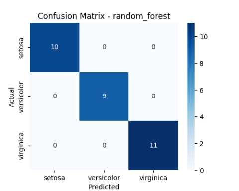
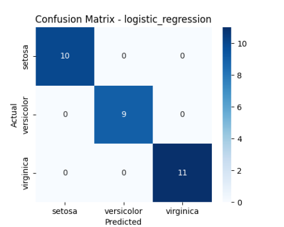
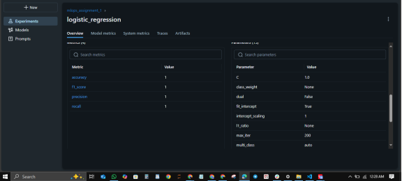
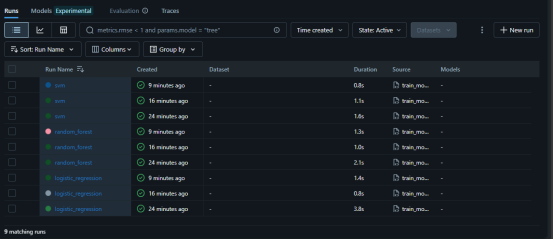
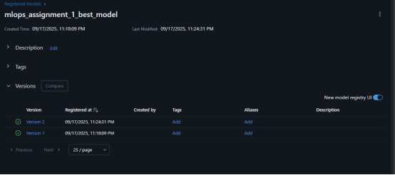

# ML Ops Assignment-1 Report

**Repo Link:** [mlops-assignment-1](https://github.com/SobanSageer/mlops-assignment-1)

---

## 1. Problem Statement
The purpose of this ML Ops assignment is to demonstrate the end-to-end machine learning workflow including dataset selection, model training, experiment tracking with MLflow, and model registration.

- **Dataset:** Iris dataset (classification problem)  
- **Task:** Predict the species of iris flowers (*setosa, versicolor, virginica*) based on their physical measurements.  
- **Importance:** This showcases how ML Ops practices help maintain reproducibility, scalability, and monitoring in ML projects.  

---

## 2. Dataset Description
- **Source:** `sklearn.datasets.load_iris`  
- **Number of Records:** 150 samples  
- **Features:** 4 numerical features (sepal length, sepal width, petal length, petal width)  
- **Target:** Species of Iris (3 classes)  

---

## 3. Model Selection & Comparison
We tested the following models:
1. Logistic Regression – baseline linear model  
2. Random Forest Classifier – ensemble learning approach  
3. Support Vector Machine (SVM) – linear kernel  

### Performance Metrics
| Model                | Accuracy | Precision | Recall | F1-Score |
|-----------------------|----------|-----------|--------|----------|
| Logistic Regression   | 1.00     | 1.00      | 1.00   | 1.00     |
| Random Forest         | 1.00     | 1.00      | 1.00   | 1.00     |
| SVM                   | 1.00     | 1.00      | 1.00   | 1.00     |




**Final Model Selection:**  
All models achieved perfect performance on this dataset. **Logistic Regression** was chosen as the final registered model for simplicity.

---

## 4. MLflow Logging
Each model was logged using MLflow with:
- Parameters (e.g., `n_estimators`, `kernel`, `C`)  
- Metrics (accuracy, precision, recall, F1)  
- Artifacts (saved model files, confusion matrices)  

---

## 5. Model Registration
The best-performing model (**Logistic Regression**) was registered in the MLflow Model Registry.

- **Model Name:** `mlops_assignment_best_model`  
- **Version:** 1 and 2  
- **Stage:** Production  

---

## 6. Instructions to Run the Code

1. **Clone the GitHub repository:**
   ```bash
   git clone https://github.com/SobanSageer/mlops-assignment-1.git
   cd mlops-assignment-1
   python -m venv venv
   source venv/bin/activate   # On Windows: venv\Scripts\activate
   pip install -r requirements.txt
   python train.py
   mlflow ui
